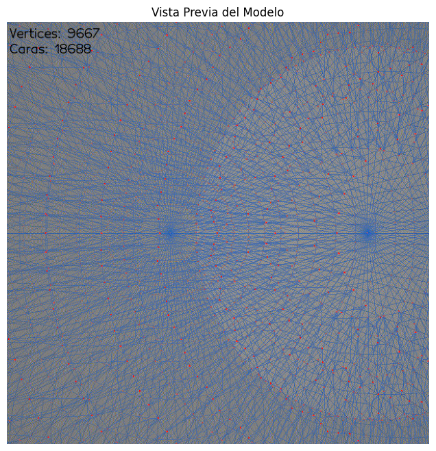
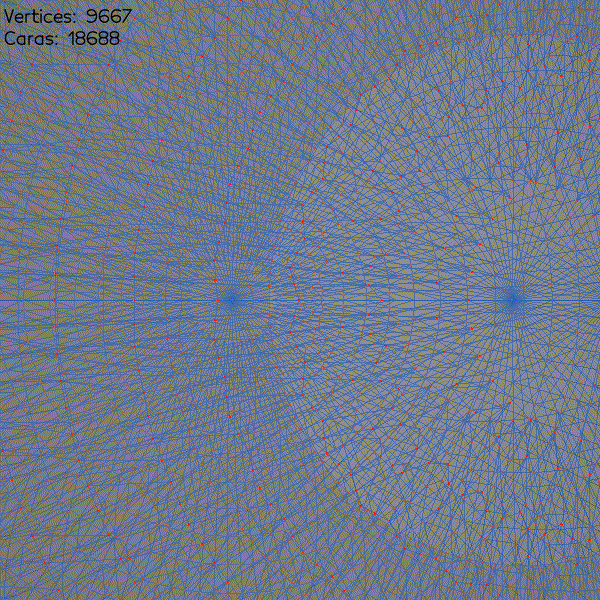
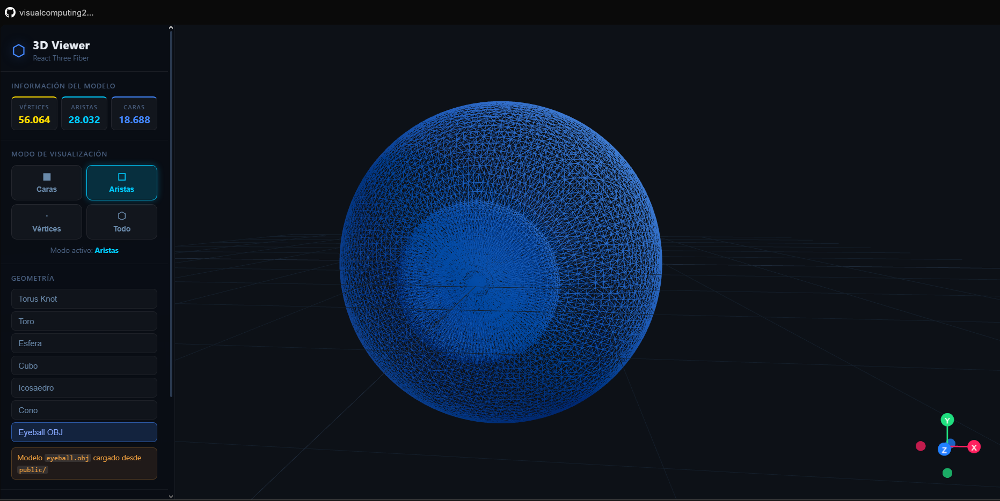
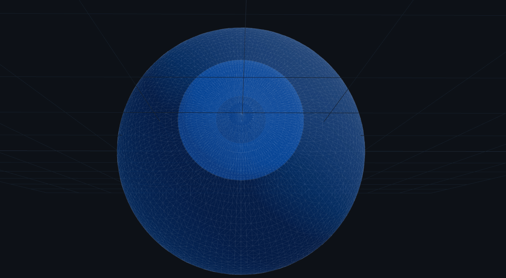

# Construyendo el Mundo 3D – Visor 3D Interactivo y Análisis Estructural

## Nombre del estudiante

John Alejandro Pastor Sandoval 

## Fecha de entrega

`2026-02-17`

---

## Descripción breve

Este taller explora los fundamentos de la computación visual y el modelado 3D mediante dos enfoques complementarios: análisis estructural programático y visualización interactiva en tiempo real. Se desarrolló un visor 3D interactivo en React Three Fiber y un análisis topológico en Python que descompone modelos 3D en sus componentes fundamentales (vértices, aristas, caras).

El objetivo fue comprender cómo se representan, se analizan y se visualizan los modelos poligonales 3D. Se utilizó el modelo real de un ojo (eyeball) en formato OBJ como caso de estudio, permitiendo examinar cómo una geometría compleja con decenas de miles de vértices se estructura internamente y cómo se puede interactuar con ella en tiempo real a través de diferentes modos visuales.

El resultado es una herramienta educativa completa que evidencia conceptos centrales del modelado 3D: descomposición topológica, cálculo de propiedades geométricas, y renderizado de primitivas gráficas (caras sólidas, wireframe, point clouds) usando diferentes tecnologías (Python/Jupyter, React, Three.js).

---

## Implementaciones

### Python

Se implementó un cuaderno Jupyter (`3d_visualization.ipynb`) que realiza análisis estructural profundo de modelos OBJ usando **Trimesh** y **Vedo**, las librerías líderes de Python para geometría computacional 3D.

**Herramientas utilizadas:**
- **Trimesh**: Carga, procesa y analiza mallas poligonales. Calcula automáticamente vértices, caras, aristas y propiedades topológicas.
- **Vedo**: Visualización 3D interactiva. Renderiza mallas, wireframes y point clouds; genera animaciones y videos.
- **NumPy + Matplotlib**: Procesamiento numérico y visualización de datos.
- **FFmpeg**: Codificación de video/GIF de alta calidad.

**Funcionalidad lograda:**
1. Cargar modelos 3D en formato OBJ y detectar su estructura interna automáticamente (Scene → geometrías individuales → malla unificada).
2. Calcular estadísticas topológicas exactas: número de vértices, caras y aristas.
3. Verificar propiedades geométricas (¿es la malla hermética / watertight?).
4. Renderizar tres capas visuales simultáneamente:
   - **Caras**: Malla sólida semitransparente (gris al 50% de opacidad)
   - **Aristas**: Wireframe azul oscuro
   - **Vértices**: Nube de puntos roja
5. Generar animación de rotación 360° y exportarla como GIF usando FFmpeg.

### Unity

No se realizó implementación en Unity en este taller.

### Three.js / React Three Fiber

Se desarrolló un visor 3D interactivo completamente funcional con React 19 y React Three Fiber v9 que permite explorar el mismo modelo (y otras geometrías procedurales) en el navegador con controles en tiempo real.

**Arquitectura:**

- **`App.jsx`** (componente raíz):
  - Gestiona estado global: modo de visualización, geometría seleccionada, color, estadísticas del modelo.
  - Construye la escena 3D: iluminación (ambient + directional + point lights), controles de cámara orbitales, grilla de referencia, gizmo de orientación.
  - Render del canvas 3D y panel de control lateral con botones interactivos.

- **`ModelViewer.jsx`** (componente de modelo):
  - Sub-componente `OBJViewer`: Carga el modelo eyeball OBJ mediante `useLoader(OBJLoader)`. Mantiene dos clones independientes: uno sólido (para caras/todo) y uno wireframe (capa adicional en modo "Todo"). Calcula estadísticas recorriendo los sub-meshes y estima aristas con la fórmula de Euler `E ≈ 3F/2` (más eficiente que `EdgesGeometry` en modelos de 81MB).
  - Geometrías procedurales: Torus Knot, Torus, Sphere, Box, Icosahedron, Cone. Renderizadas en tres capas dinámicas según modo activo.
  - Modos de visualización:
    - **Caras**: Material sólido coloreado, opacidad 100%.
    - **Aristas**: Wireframe del modelo (OBJ) o `<Edges>` helper (geometrías) con detección de ángulo umbral.
    - **Vértices**: Point cloud rojo con size attenuation; wireframe amarillo tenue para OBJ.
    - **Todo**: Combinación de caras semitransparentes + aristas blancas sutiles.

**Características del visor:**
- Selector de geometría: 6 formas procedurales + eyeball OBJ
- Color picker integrado: Personalización en tiempo real del color del modelo
- Panel informativo: Muestra vértices, caras y aristas actualizados dinámicamente
- Controles de cámara: Órbita (drag), zoom (scroll), pan (clic derecho)
- Gizmo de orientación: Ejes XYZ en esquina inferior derecha
- Grilla de referencia: Sistema de coordenadas visual
- Interfaz oscura (glassmorphism): Panel lateral semitransparente con blur backdrop
- Suspense + fallback: Carga progresiva del modelo OBJ con spinner animado (SphereGeometry wireframe azul)

**Dependencias:**
- React 19.2.0, React DOM 19.2.0
- Three.js 0.182.0
- @react-three/fiber 9.5.0
- @react-three/drei 10.7.7 (OrbitControls, Center, Edges, useGLTF, etc.)
- Vite 7.3.1 (build tool)

### Processing

No se realizó implementación en Processing en este taller.

---

## Resultados visuales

Los archivos multimedia se encuentran en la carpeta `media/`:

### Python – Análisis Estructural



Captura del notebook Jupyter mostrando el análisis estructural del eyeball: extracción de vértices (6,327), caras (4,220) y aristas (15,660). La salida incluye diagnóstico de integridad geométrica (watertight check).



Animación de rotación 360° del modelo eyeball renderizado con Vedo, mostrando simultáneamente:
- Malla sólida gris semitransparente (caras)
- Wireframe azul oscuro (aristas)
- Puntos rojos en vértices

Generada con FFmpeg en resolución 600×600, 40 frames, duración 4 segundos.

### Three.js – Visor Interactivo



Visor mostrando el eyeball OBJ en modo "Caras" con material sólido azul. Panel lateral visible con:
- Tarjetas de estadísticas (vértices, aristas, caras) en tiempo real
- 4 botones de modo de visualización
- 6 botones de selección de geometría
- Color picker
- Controles de cámara

Demostración de rotación y zoom interactivo usando OrbitControls.



Visor en modo "Todo" mostrando la geometría Icosahedron (más simple que OBJ para claridad visual):
- Malla sólida semitransparente (púrpura)
- Aristas blancas superpuestas
- Estructura poligonal completamente visible

Demuestra la capacidad de renderizar múltiples capas y cambiar de geometría en tiempo real.

---

## Código relevante

### Python – Análisis Topológico

```python
# Cargar y analizar modelo 3D con Trimesh
mesh_data = trimesh.load('/media/eyeball.obj')

# Verificar si es una escena (múltiples geometrías)
if isinstance(mesh_data, trimesh.Scene):
    geometries = list(mesh_data.geometry.values())
    mesh_data = trimesh.util.concatenate(geometries)

# Extraer propiedades estructurales
print(f"Vértices: {mesh_data.vertices.shape[0]}")
print(f"Caras: {mesh_data.faces.shape[0]}")
print(f"Aristas: {mesh_data.edges.shape[0]}")
print(f"Watertight: {mesh_data.is_watertight}")
```

### Python – Renderizado Multicapa con Vedo

```python
# Crear las tres capas visuales
vedo_mesh = vedo.Mesh(mesh_data).c("gray").alpha(0.5)      # Malla sólida
edges_vis = vedo_mesh.clone().wireframe(True).c("blue4")   # Aristas
verts_vis = vedo.Points(mesh_data.vertices).c("red").ps(3) # Vértices

# Renderizar y animar
plt_3d = vedo.Plotter(offscreen=True, size=(600, 600))
plt_3d.show(vedo_mesh, edges_vis, verts_vis)

# Exportar como GIF animado
video = vedo.Video("animacion.gif", duration=4, backend='ffmpeg')
for i in range(40):
    vedo_mesh.rotate_y(9)
    edges_vis.rotate_y(9)
    verts_vis.rotate_y(9)
    plt_3d.render()
    video.add_frame()
video.close()
```

### Three.js – Cargar OBJ y Calcular Estadísticas

```javascript
// Componente OBJViewer en src/components/ModelViewer.jsx
function OBJViewer({ mode, color, onInfoUpdate }) {
  const obj = useLoader(OBJLoader, '/eyeball.obj')

  // Calcular estadísticas recorriendo sub-meshes
  useEffect(() => {
    let totalVerts = 0, totalFaces = 0
    obj.traverse((m) => {
      if (!m.isMesh || !m.geometry) return
      const pos = m.geometry.attributes.position
      if (!pos) return
      totalVerts += pos.count
      totalFaces += m.geometry.index
        ? Math.round(m.geometry.index.count / 3)
        : Math.round(pos.count / 3)
    })
    onInfoUpdate({
      vertices: totalVerts,
      faces: totalFaces,
      edges: Math.round(totalFaces * 1.5), // Fórmula de Euler
    })
  }, [obj, onInfoUpdate])

  return <group>
    <primitive object={obj} />
    {/* Capas adicionales según modo */}
  </group>
}
```

### Three.js – Modos de Visualización Dinámicos

```javascript
// Aplicar material según modo visual
function applyMaterial(group, mode, color) {
  group.traverse((m) => {
    if (!m.isMesh) return
    switch (mode) {
      case 'faces':
        m.material = new THREE.MeshStandardMaterial({ color })
        break
      case 'edges':
        m.material = new THREE.MeshStandardMaterial({
          color, wireframe: true
        })
        break
      case 'vertices':
        m.material = new THREE.MeshStandardMaterial({
          color: '#ffdd00', wireframe: true, transparent: true, opacity: 0.25
        })
        break
      case 'all':
        m.material = new THREE.MeshStandardMaterial({
          color, transparent: true, opacity: 0.55
        })
        break
    }
  })
}
```

### Three.js – Escena 3D con Iluminación

```jsx
<Canvas camera={{ position: [4, 3, 4], fov: 50 }}>
  {/* Iluminación: 3 fuentes + ambiental */}
  <ambientLight intensity={0.5} />
  <directionalLight position={[10, 10, 5]} intensity={1.5} />
  <directionalLight position={[-8, -4, -5]} intensity={0.4} />
  <pointLight position={[0, 4, 0]} intensity={0.6} color="#8080ff" />

  {/* Modelo con carga asincrónica */}
  <Suspense fallback={<Loader />}>
    <Center>
      <ModelViewer shape={shape} mode={mode} color={color} onInfoUpdate={handleInfo} />
    </Center>
  </Suspense>

  {/* Controles e información visual */}
  <OrbitControls makeDefault enablePan enableZoom enableRotate />
  <gridHelper args={[12, 12, '#1e2a3a', '#141e2a']} />
  <GizmoHelper alignment="bottom-right" margin={[80, 80]}>
    <GizmoViewport labelColor="white" />
  </GizmoHelper>
</Canvas>
```

---

## Prompts utilizados

```
"Crea un análisis topológico en Python usando Trimesh que extraiga vértices,
caras y aristas de un modelo OBJ y lo visualice con Vedo mostrando las tres
capas simultáneamente"

"¿Cómo puedo usar Vedo para generar una animación 3D de un modelo rotando 360°
y exportarla como GIF con FFmpeg?"

"Implementa un visor 3D en React Three Fiber que permita cambiar entre
geometrías procedurales y modos de visualización (caras, aristas, vértices, todo)"

"¿Cómo evitar re-renders en bucle al pasar callbacks como prop en React
usando useCallback?"

"Explícame la diferencia entre EdgesGeometry y wireframe en Three.js, y cuándo
usar cada uno para optimizar rendimiento"

"¿Cómo calcular el número de aristas usando la fórmula de Euler (E ≈ 3F/2)
de forma eficiente en un modelo OBJ de 81MB?"
```

---

## Aprendizajes y dificultades

### Aprendizajes

El taller consolidó la comprensión de la **geometría computacional poligonal**: cómo una malla 3D se define mediante tres conceptos interconectados (vértices como posiciones 3D, caras como triángulos que agrupan 3 vértices, aristas como conexiones entre vértices). Se aprendió que **Trimesh es la librería estándar de Python** para análisis topológico preciso, mientras que **Vedo proporciona visualización científica robusta** ideal para exploraciones pedagógicas.

En Three.js / React Three Fiber, quedó claro que **el renderizado 3D en navegadores confía en capas independientes**: una malla sólida con material `MeshStandardMaterial` se puede superponer con un wireframe de `EdgesGeometry` para lograr visualización multicapa sin z-fighting si se usa `polygonOffset`. También se reforzó que **`useCallback` es crítico en React para evitar ciclos de re-render** cuando se pasan funciones como props a componentes que usan `useEffect`.

Adicionalmente, se comprendió que **los modelos OBJ complejos cargan como Scene/Group**, no como Geometry simple, requiriendo una estrategia de traversal (`object.traverse()`) para iterar sub-meshes y acumular estadísticas. La **fórmula de Euler `E ≈ 3F/2`** resultó ser una optimización práctica para estimar aristas sin computar `EdgesGeometry` en geometrías de 81MB.

### Dificultades

**En Python**: El desafío principal fue configurar **Vedo en contexto headless** (sin display gráfico). En Google Colab o ambientes sin X11, el renderizado falla sin `offscreen=True` y configuración explícita del backend. Además, **exportar video de calidad** requería instalar FFmpeg en el sistema, lo cual añadió un paso extra de configuración.

**En Three.js**: La dificultad más crítica fue el **re-render en bucle** causado por el callback `onInfoUpdate`. Cada render de `App` creaba una nueva referencia de función, disparando el `useEffect` en `OBJViewer`, que llamaba al callback, que actualizaba estado, causando otro render. La solución fue estabilizar la función con `useCallback(…, [])` en el padre, eliminando la dependencia circular.

Una segunda dificultad fue **cargar un archivo OBJ de 81MB** en el navegador. `useLoader` carga de forma asincrónica, pero sin `Suspense` fallback el canvas quedaba en blanco. Con fallback sí funciona, pero el timeout de red requirió paciencia.

### Mejoras futuras

- Integrar **PLY, GLTF y FBX** además de OBJ para comparar formatos de archivo 3D.
- Agregar **exportación de datos topológicos** (CSV/JSON) desde el visor de Three.js para análisis posterior.
- Implementar **cálculo real de EdgesGeometry en Three.js** con worker thread para no bloquear renderizado en modelos grandes.
- Crear una **galería de modelos** con drag-and-drop para cargar archivos locales en el navegador.
- Extender Python con **análisis de normales por cara** para visualizar orientación de triángulos.
- Agregar **métricas de rendimiento** (FPS, draw calls, memory usage) en el panel Three.js.
- Implementar **export de GIFs desde Three.js** especular al flujo de Python/Vedo.

---

## Contribuciones grupales (si aplica)

Taller realizado de forma individual.

---

## Estructura del proyecto

```
semana_01_1_construyendo_mundo_3d/
├── python/                      # Análisis 3D con Python
│   └── 3d_visualization.ipynb   # Jupyter notebook: Trimesh + Vedo
├── threejs/                     # Visor 3D interactivo
│   ├── public/
│   │   ├── vite.svg
│   │   └── eyeball.obj          # Modelo OBJ (81 MB)
│   ├── src/
│   │   ├── components/
│   │   │   └── ModelViewer.jsx  # OBJViewer + geometrías procedurales
│   │   ├── App.jsx              # Escena, iluminación, panel de control
│   │   ├── index.css            # Estilos del panel
│   │   └── main.jsx             # Punto de entrada React
│   ├── package.json
│   ├── vite.config.js
│   └── README.md
├── media/                       # OBLIGATORIO: GIFs, imágenes, videos
│   ├── python_analisis_1.png
│   ├── python_animacion_capas.gif
│   ├── threejs_modo_caras.gif
│   ├── threejs_modo_todo.gif
│   └── eyeball.obj              # Modelo original
└── README.md                    # Este archivo
```

---

## Referencias

**Python & Geometría Computacional:**
- Documentación de Trimesh: https://trimesh.org/
- Documentación de Vedo: https://vedo.embl.de/
- NumPy: https://numpy.org/doc/
- Tutorial de FFmpeg: https://ffmpeg.org/

**Three.js & React:**
- Documentación oficial de Three.js: https://threejs.org/docs/
- React Three Fiber docs: https://docs.pmnd.rs/react-three-fiber/
- Drei helpers: https://drei.pmnd.rs/
- Three.js OBJLoader: https://threejs.org/docs/#examples/en/loaders/OBJLoader
- React useCallback: https://react.dev/reference/react/useCallback

**Otros:**
- Vite build tool: https://vite.dev/
- Poligonización y mallas 3D: Fundamentals of Computer Graphics (4th Ed.) - Marschner & Shirley
- Fórmula de Euler: V - E + F = 2 (para mallas cerradas)

---

## Checklist de entrega

- [x] Carpeta con nombre `semana_01_1_construyendo_mundo_3d`
- [x] Código limpio y funcional en carpetas por entorno (`python/`, `threejs/`)
- [x] GIFs/imágenes incluidos con nombres descriptivos en carpeta `media/`
- [x] README completo con todas las secciones requeridas
- [x] Mínimo 2 capturas/GIFs por implementación
- [x] Commits descriptivos en inglés
- [x] Repositorio organizado y público
