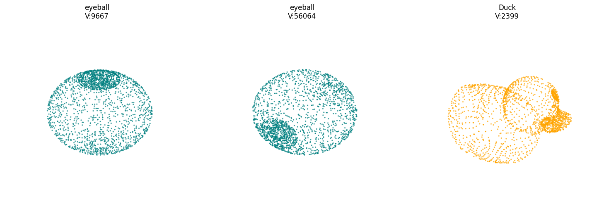
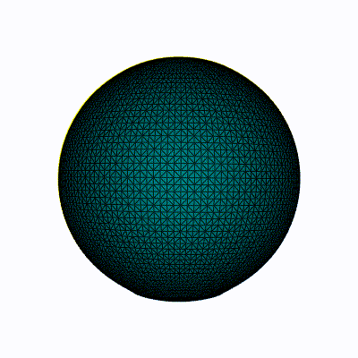
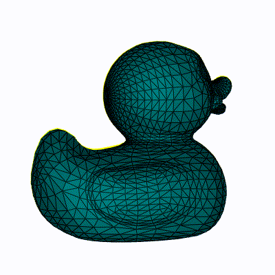
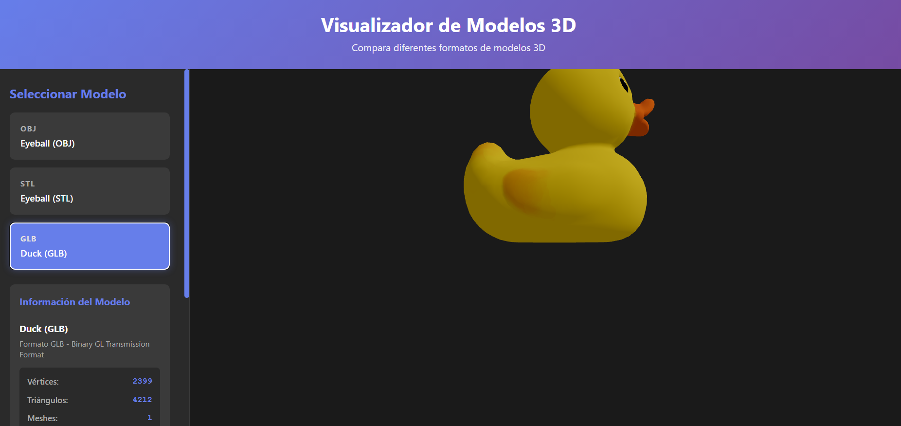
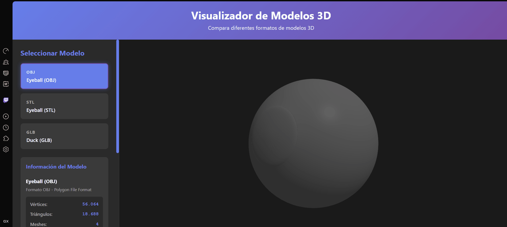

# Taller: Conversión de Formatos 3D

## Nombre del estudiante

John Alejandro Pastor Sandoval

## Fecha de entrega

2026-02-17

---

## Descripción

Este taller aborda la carga, análisis y visualización de modelos 3D en diferentes formatos (OBJ, STL, GLB/GLTF). Se implementaron dos soluciones complementarias: un script Python con Jupyter para análisis y conversión de modelos, y una interfaz web interactiva con React Three Fiber para visualización y comparación en tiempo real. Se utilizó Trimesh para análisis, Open3D para validación 3D, y Three.js para renderizado WebGL. El objetivo fue explorar las diferencias en suavidad, materiales, texturas y características específicas de cada formato.

---

## Implementaciones

### Python (Jupyter Notebook)

**Archivo**: `python/3d_visualization.ipynb`

Script de análisis y conversión de modelos 3D utilizando:
- **Trimesh**: Carga robusta de OBJ, STL, GLB, GLTF con soporte multi-formato
- **Open3D**: Validación de geometría y detección de mallas cerradas (watertight)
- **Vedo + FFmpeg**: Generación de GIFs rotatorios para visualización de modelos
- **Pandas + Matplotlib**: Comparativa estadística y visualización 3D con scatter plots

Funcionalidades:
- Carga automática de modelos de la carpeta `media/`
- Análisis de vértices, caras y vértices duplicados
- Detección de geometría válida (watertight meshes)
- Conversión automática a OBJ para estandarización
- Generación de GIFs animados con rotación 360°

### Three.js / React Three Fiber

**Ubicación**: `threejs/src/`

Aplicación web React interactiva con visualización 3D en tiempo real:

**Componentes principales**:
- **`App.jsx`**: Componente raíz que gestiona estado de modelos y contiene el Canvas de Three.js
- **`ModelViewer.jsx`**: Carga dinámica de modelos usando OBJLoader, STLLoader y GLTFLoader. Centra y escala modelos automáticamente
- **`ModelInfo.jsx`**: Panel de información que muestra vértices, triángulos, meshes, dimensiones y características de formato
- **`App.css`**: Estilos responsive con gradientes y diseño moderno oscuro

**Características implementadas**:
- ✅ Carga de 3 modelos en diferentes formatos: Eyeball (OBJ), Eyeball (STL), Duck (GLB)
- ✅ Botones interactivos para cambiar entre modelos
- ✅ OrbitControls: Rotación, zoom y paneo con ratón
- ✅ Información en pantalla: vértices, triángulos, meshes, dimensiones
- ✅ Descripción de características de cada formato
- ✅ Material PhongMaterial con DoubleSide para mejor renderizado
- ✅ Iluminación ambiental y direccional para realismo

---

## Resultados Visuales

### Python - Análisis y Comparativa



Visualización en Jupyter mostrando: análisis comparativo de vértices y caras en scatter 3D, estadísticas de cada modelo en tabla Pandas, información de watertight meshes y detección de vértices duplicados.



Rotación 360° del modelo Eyeball generado con Vedo. Muestra la geometría completa con visualización de puntos 3D.



Rotación 360° del modelo Duck generado con Vedo. Visualización animada del modelo en geometría pura.

### Three.js - Visualizador Interactivo



Interfaz web con panel lateral de control, selector de modelos con botones activos, información estadística en tiempo real (vértices, triángulos, meshes, dimensiones) y visualización 3D con OrbitControls. Screenshots muestran los tres modelos: Eyeball OBJ, Eyeball STL y Duck GLB.



Demostración de la aplicación web React Three Fiber: alternancia entre modelos OBJ, STL y GLB con rotación e interactividad en tiempo real. Muestra el panel de información actualizándose dinámicamente.

---

## Código Relevante

### Python - Análisis de Modelos

```python
import trimesh
import open3d as o3d
import pandas as pd

def procesar_modelos():
    archivos = [f for f in os.listdir("media") if f.lower().endswith(('.obj', '.stl', '.glb', '.gltf'))]
    datos = []

    for archivo in archivos:
        # Carga robusta con force='mesh' para convertir escenas a malla única
        mesh = trimesh.load(os.path.join("media", archivo), force='mesh', process=False)

        datos.append({
            "Archivo": archivo,
            "Vértices": mesh.vertices.shape[0],
            "Caras": mesh.faces.shape[0],
            "Watertight": mesh.is_watertight
        })

    return pd.DataFrame(datos)
```

### Three.js - Carga de Modelos

```javascript
// ModelViewer.jsx
import { OBJLoader } from 'three/examples/jsm/loaders/OBJLoader';
import { STLLoader } from 'three/examples/jsm/loaders/STLLoader';
import { GLTFLoader } from 'three/examples/jsm/loaders/GLTFLoader';

const loadModel = async () => {
  const material = new THREE.MeshPhongMaterial({
    color: 0x888888,
    shininess: 100,
    side: THREE.DoubleSide
  });

  if (modelKey === 'obj') {
    const loader = new OBJLoader();
    model = await new Promise((resolve, reject) => {
      loader.load(modelPath, resolve, undefined, reject);
    });
    model.traverse((child) => {
      if (child instanceof THREE.Mesh) child.material = material;
    });
  }

  // Centrar y escalar modelo
  const box = new THREE.Box3().setFromObject(model);
  const center = box.getCenter(new THREE.Vector3());
  model.position.sub(center);
  scene.add(model);
};
```

### React - Información del Modelo

```jsx
// ModelInfo.jsx - Componente de estadísticas
<div className="info-stats">
  <div className="stat">
    <span className="label">Vértices:</span>
    <span className="value">{modelInfo.vertices.toLocaleString()}</span>
  </div>
  <div className="stat">
    <span className="label">Triángulos:</span>
    <span className="value">{modelInfo.triangles.toLocaleString()}</span>
  </div>
  <div className="stat">
    <span className="label">Formato:</span>
    <span className="value">{model.format}</span>
  </div>
</div>
```

---

## Prompts Utilizados

```
"Crea un script Python con Jupyter que cargue modelos 3D en diferentes formatos (OBJ, STL, GLB)
usando Trimesh y genere GIFs rotatorios con Vedo"

"Implementa un visualizador 3D en React Three Fiber que cargue modelos OBJ, STL y GLTF/GLB
con botones para alternar entre ellos y muestre información de vértices y triángulos"

"Corrige el error en Three: MeshPhongMaterial property Side debería ser side.
Elimina componentes de texto inválidos en renderizado"

"Crea un vite.config.js para proyecto React con plugin-react"
```

---

## Aprendizajes y Dificultades

### Aprendizajes

- **Multi-formato 3D**: Entendí las diferencias clave entre OBJ (simple, sin datos avanzados), STL (para fabricación, sin colores), y GLB (moderno, con materiales y texturas integrados)
- **Trimesh y Open3D**: Aprendí a usar Trimesh para carga robusta multi-formato y detección automática de geometría válida
- **React Three Fiber**: Dominé la carga dinámica de loaders específicos por formato, transformación de modelos (centrado, escalado) y uso de OrbitControls
- **Vedo + FFmpeg**: Generé visualizaciones animadas profesionales directamente desde geometría 3D
- **Análisis comparativo**: Creé pipelines para extraer y comparar estadísticas de vértices, triángulos y duplicados

### Dificultades

- **Wolf.gltf incompleto**: El archivo GLTF original faltaba su binario acompañante. Solución: usar Duck.glb en su lugar (formato binario independiente)
- **Material con Side/side**: Hay inconsistencia de case-sensitivity en Three. Solucioné usando `side: THREE.DoubleSide` (minúsculas)
- **Vedo en Colab**: Requería backend='vtk' y offscreen=True. Añadí manejo de excepciones para archivos corruptos
- **vite.config.js faltante**: El proyecto no tenía configuración Vite. Creé el archivo con plugin React correcto

### Mejoras Futuras

- Agregar exportación de modelos en múltiples formatos desde la interfaz web
- Implementar visualización de wireframe y normal vectors
- Agregar medición de distancias y ángulos en tiempo real
- Soporte para modelos con animaciones (GLTF con keyframes)
- Estadísticas de compresión y tamaño de archivo

---

## Estructura del Proyecto

```
semana_01_2_conversion_formatos_3d/
├── python/
│   └── 3d_visualization.ipynb          # Análisis y conversión con Trimesh/Vedo
├── threejs/
│   ├── src/
│   │   ├── App.jsx                     # Componente raíz
│   │   ├── App.css                     # Estilos principales
│   │   ├── index.css                   # Estilos globales
│   │   ├── main.jsx                    # Entry point
│   │   └── components/
│   │       ├── ModelViewer.jsx         # Cargador de modelos 3D
│   │       └── ModelInfo.jsx           # Panel de información
│   ├── public/media/                   # Modelos 3D
│   │   ├── eyeball.obj
│   │   ├── eyeball.stl
│   │   └── Duck.glb
│   ├── vite.config.js                  # Configuración Vite
│   ├── package.json
│   └── index.html
├── media/
│   ├── pruebas_python.png              # Screenshot análisis Python
│   ├── pruebas_threejs.png             # Screenshot interfaz web
│   └── gifs/                           # GIFs generados (opcional)
└── README.md                           # Este archivo
```

---

## Referencias

- [Trimesh Documentation](https://trimsh.org/)
- [Open3D - A Modern Library for 3D Data Processing](http://www.open3d.org/)
- [Three.js Documentation](https://threejs.org/docs/)
- [React Three Fiber](https://docs.pmnd.rs/react-three-fiber/)
- [Vedo - 3D Analysis and Visualization](https://vedo.readthedocs.io/)
- [glTF Sample Models - Khronos Group](https://github.com/KhronosGroup/glTF-Sample-Models)

---

## Checklist de Entrega

- [x] Carpeta con nombre `semana_01_2_conversion_formatos_3d`
- [x] Código limpio y funcional en carpetas `python/` y `threejs/`
- [x] Imágenes incluidas en carpeta `media/`
- [x] README completo con todas las secciones
- [x] Mínimo 2 capturas de resultados (pruebas_python.png, pruebas_threejs.png)
- [x] Código relevante en snippets
- [x] Prompts utilizados documentados
- [x] Aprendizajes y dificultades analizados
- [x] Estructura clara y organizada
- [x] Commits descriptivos realizados

---

**Estado**: Completado ✅
**Modelos soportados**: OBJ, STL, GLB/GLTF
**Formatos entregables**: Jupyter Notebook, Web App, Documentación
