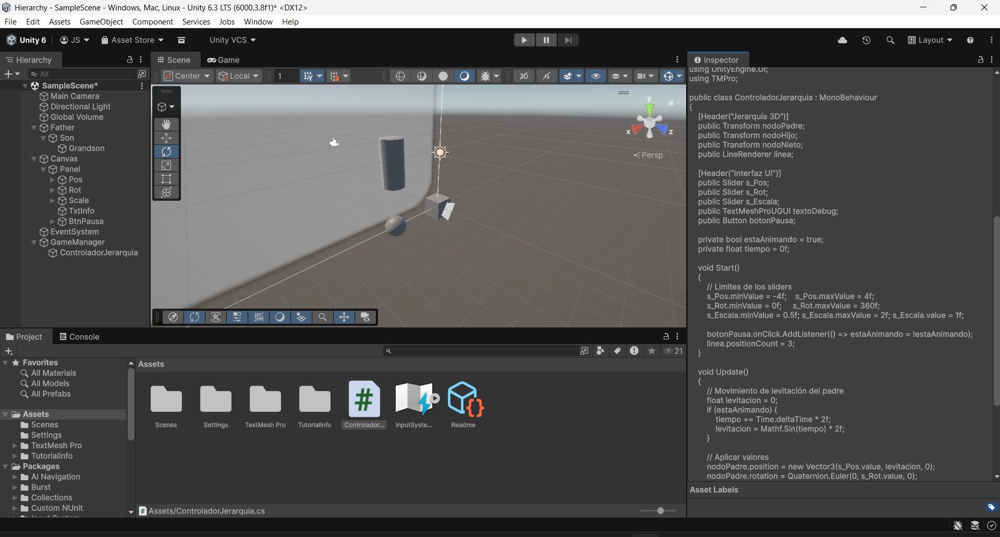
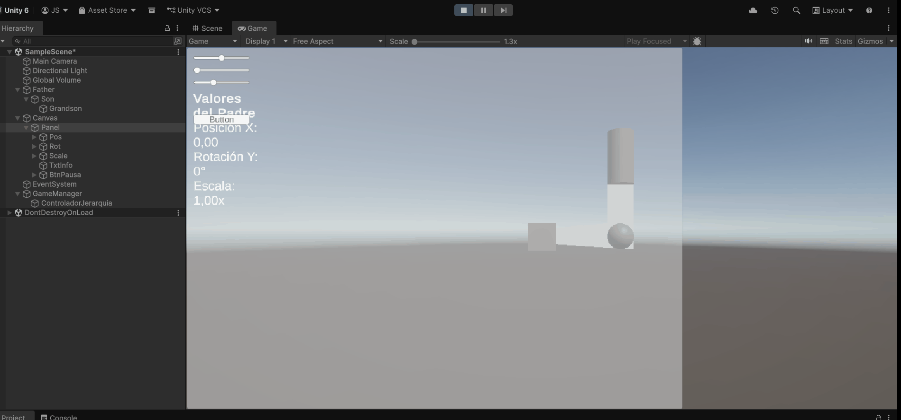

# Taller Jerarquias Transformaciones

## Nombre del estudiante

John Alejandro Pastor Sandoval

## Fecha de entrega

2026-02-19

---

## Descripción breve

Este taller explora los conceptos fundamentales de jerarquías y transformaciones en sistemas 3D, usando dos lenguajes y entornos diferentes: Unity y Three.js. El objetivo principal es demostrar cómo la transformación de un objeto padre afecta automáticamente a sus hijos en la jerarquía de escena, y cómo cada nivel puede aplicar sus propias transformaciones de forma independiente.

Se implementó un sistema de tres niveles jerárquicos en ambos entornos: un objeto padre que controla la posición, rotación y escala general; un objeto hijo que hereda las transformaciones del padre pero puede tener sus propias transformaciones locales; y un objeto nieto que hereda las transformaciones acumuladas del padre y el hijo. Esta estructura permite entender claramente cómo funcionan las transformaciones compuestas y la propagación de cambios a través de la jerarquía.

La implementación incluye controles interactivos en ambos entornos, permitiendo manipular en tiempo real cada nivel de la jerarquía y observar cómo se afectan mutuamente. Esta experiencia interactiva facilita la comprensión profunda de conceptos esenciales en modelado 3D y animación.

---

## Implementaciones

### Unity

En Unity, se desarrolló un proyecto completo que demuestra la jerarquía de transformaciones mediante un script `ControladorJerarquia.cs`. La implementación incluye tres GameObjects independientes (padre, hijo y nieto) conectados en una jerarquía visual en el Inspector. 

El script principal proporciona una interfaz de usuario interactiva con tres sliders que controlan:
- **Posición X del padre**: Desplaza horizontalmente todo el sistema jerárquico
- **Rotación Y del padre**: Rota el sistema completo alrededor del eje vertical
- **Escala del padre**: Amplía o reduce el tamaño del sistema completo

Además, se implementó:
- Una animación de levitación suave en el padre usando funciones trigonométricas
- Un `LineRenderer` que visualiza las conexiones entre los nodos
- Un texto de depuración que muestra los valores actuales de las transformaciones
- Un botón de pausa para detener la animación de levitación

La interfaz de usuario proporciona retroalimentación visual instantánea de cómo cada transformación del padre afecta a toda la jerarquía.

### Three.js / React Three Fiber

En Three.js, se implementó una solución moderna usando React y la librería `react-three-fiber`. El componente `HierarchyDemo.jsx` crea una jerarquía de tres niveles:

1. **Padre (Nivel 1)**: Un cubo rojo de 1.5×1.5×1.5 unidades
2. **Hijo (Nivel 2)**: Un cilindro azul que se posiciona relativo al padre
3. **Nieto (Nivel 3)**: Una esfera verde y un pequeño cubo amarillo que se posicionan relativo al hijo

La implementación utiliza la librería `leva` para crear controles interactivos para cada nivel jerárquico:
- Cada nivel tiene controles independientes para: posición X, Y, Z; rotación X, Y, Z
- Se implementó un modo de auto-rotación que hace girar automáticamente el padre
- Los objetos se renderizan con sombras para mayor realismo
- Se usa `useFrame` para actualizar las transformaciones en cada fotograma

La ventaja de esta implementación es que permite entender cómo las transformaciones se heredan y se componen en una jerarquía de escena, con la capacidad de ver en tiempo real cómo cada cambio afecta a todos los niveles inferiores.

---

## Resultados visuales

### Unity - Jerarquía Base



Esta captura muestra la interfaz completa del proyecto Unity con los tres GameObjects en la escena. Se puede observar el padre (posicionado por los sliders), el hijo conectado al padre, y el nieto conectado al hijo. El LineRenderer crea un trazo visual que conecta los tres nodos, facilitando la visualización de la jerarquía. Los valores en pantalla muestran la posición X, rotación Y y escala del padre.

### Unity - Animación de Jerarquía



Este GIF muestra la animación en tiempo real del sistema jerárquico de Unity. Se puede observar:
- La levitación suave del padre (movimiento vertical sinusoidal)
- La rotación controlada por el slider de rotación Y
- Cómo el hijo y el nieto siguen los movimientos del padre automáticamente
- Las conexiones línea visualizadas per el LineRenderer

### Three.js - Jerarquía Inicial


Esta captura muestra la posición inicial de los tres objetos en Three.js: el cubo rojo (padre) en el centro, el cilindro azul (hijo) posicionado a la derecha del padre, y la esfera verde (nieto) posicionada a la derecha del cilindro. Esta configuración inicial permite ver claramente cómo cada elemento está posicionado de forma relativa a su padre.

### Three.js - Transformación del Nieto


Este GIF demuestra la versatilidad del sistema jerárquico en Three.js. El video muestra cómo el nieto (esfera verde) puede tener su propia rotación independiente mientras mantiene su posición relativa al hijo. Se puede observar el movimiento del cubo pequeño amarillo (gran-nieto) que orbita alrededor del nieto, mostrando cómo las transformaciones se propagan a través de múltiples niveles jerárquicos.

---

## Código relevante

### Código Unity - Script de Control de Jerarquía

```csharp
using UnityEngine;
using UnityEngine.UI;
using TMPro;

public class ControladorJerarquia : MonoBehaviour
{
    [Header("Jerarquía 3D")]
    public Transform nodoPadre;
    public Transform nodoHijo;
    public Transform nodoNieto;
    public LineRenderer linea;

    [Header("Interfaz UI")]
    public Slider s_Pos;
    public Slider s_Rot;
    public Slider s_Escala;
    public TextMeshProUGUI textoDebug;
    public Button botonPausa;

    private bool estaAnimando = true;
    private float tiempo = 0f;

    void Start()
    {
        // Limites de los sliders
        s_Pos.minValue = -4f;    s_Pos.maxValue = 4f;
        s_Rot.minValue = 0f;     s_Rot.maxValue = 360f;
        s_Escala.minValue = 0.5f; s_Escala.maxValue = 2f;
        
        botonPausa.onClick.AddListener(() => estaAnimando = !estaAnimando);
        linea.positionCount = 3;
    }

    void Update()
    {
        // Movimiento de levitación del padre
        float levitacion = 0;
        if (estaAnimando) {
            tiempo += Time.deltaTime * 2f;
            levitacion = Mathf.Sin(tiempo) * 2f;
        }

        // Aplicar transformaciones
        nodoPadre.position = new Vector3(s_Pos.value, levitacion, 0);
        nodoPadre.rotation = Quaternion.Euler(0, s_Rot.value, 0);
        nodoPadre.localScale = Vector3.one * s_Escala.value;

        // Actualizar línea de conexión
        linea.SetPosition(0, nodoPadre.position);
        linea.SetPosition(1, nodoHijo.position);
        linea.SetPosition(2, nodoNieto.position);

        // Mostrar valores actuales en UI
        textoDebug.text = $"<b>Valores del Padre</b>\n" +
                          $"Posición X: {s_Pos.value:F2}\n" +
                          $"Rotación Y: {s_Rot.value:F0}°\n" +
                          $"Escala: {s_Escala.value:F2}x";
    }
}
```

### Código Three.js - Componente de Demostración Jerárquica

```jsx
import { useRef } from 'react'
import { useFrame } from '@react-three/fiber'
import { useControls } from 'leva'

function HierarchyDemo() {
  const parentGroupRef = useRef()
  const childGroupRef = useRef()
  const grandchildRef = useRef()

  const { parentRotX, parentRotY, parentRotZ, parentPosX, parentPosY, parentPosZ,
    childRotX, childRotY, childRotZ, childPosX, childPosY, childPosZ,
    grandchildRotX, grandchildRotY, grandchildRotZ, grandchildPosX, grandchildPosY, grandchildPosZ,
    autoRotate } = useControls({
    // Controles del Padre (Nivel 1)
    parentRotX: { value: 0, min: -Math.PI, max: Math.PI, step: 0.01 },
    parentRotY: { value: 0, min: -Math.PI, max: Math.PI, step: 0.01 },
    parentRotZ: { value: 0, min: -Math.PI, max: Math.PI, step: 0.01 },
    parentPosX: { value: 0, min: -10, max: 10, step: 0.1 },
    parentPosY: { value: 0, min: -10, max: 10, step: 0.1 },
    parentPosZ: { value: 0, min: -10, max: 10, step: 0.1 },
    // Controles del Hijo (Nivel 2)
    childRotX: { value: 0, min: -Math.PI, max: Math.PI, step: 0.01 },
    childRotY: { value: 0, min: -Math.PI, max: Math.PI, step: 0.01 },
    childRotZ: { value: 0, min: -Math.PI, max: Math.PI, step: 0.01 },
    childPosX: { value: 4, min: -10, max: 10, step: 0.1 },
    childPosY: { value: 0, min: -10, max: 10, step: 0.1 },
    childPosZ: { value: 0, min: -10, max: 10, step: 0.1 },
    // Controles del Nieto (Nivel 3)
    grandchildRotX: { value: 0, min: -Math.PI, max: Math.PI, step: 0.01 },
    grandchildRotY: { value: 0, min: -Math.PI, max: Math.PI, step: 0.01 },
    grandchildRotZ: { value: 0, min: -Math.PI, max: Math.PI, step: 0.01 },
    grandchildPosX: { value: 3, min: -10, max: 10, step: 0.1 },
    grandchildPosY: { value: 0, min: -10, max: 10, step: 0.1 },
    grandchildPosZ: { value: 0, min: -10, max: 10, step: 0.1 },
    autoRotate: false,
  })

  useFrame(() => {
    if (parentGroupRef.current) {
      parentGroupRef.current.position.set(parentPosX, parentPosY, parentPosZ)
      parentGroupRef.current.rotation.order = 'XYZ'
      parentGroupRef.current.rotation.x = parentRotX
      parentGroupRef.current.rotation.y = parentRotY
      parentGroupRef.current.rotation.z = parentRotZ

      if (autoRotate) {
        parentGroupRef.current.rotation.y += 0.005
      }
    }

    if (childGroupRef.current) {
      childGroupRef.current.position.set(childPosX, childPosY, childPosZ)
      childGroupRef.current.rotation.order = 'XYZ'
      childGroupRef.current.rotation.x = childRotX
      childGroupRef.current.rotation.y = childRotY
      childGroupRef.current.rotation.z = childRotZ
    }

    if (grandchildRef.current) {
      grandchildRef.current.position.set(grandchildPosX, grandchildPosY, grandchildPosZ)
      grandchildRef.current.rotation.order = 'XYZ'
      grandchildRef.current.rotation.x = grandchildRotX
      grandchildRef.current.rotation.y = grandchildRotY
      grandchildRef.current.rotation.z = grandchildRotZ
    }
  })

  return (
    <group ref={parentGroupRef}>
      {/* PADRE - Cubo rojo */}
      <mesh castShadow receiveShadow>
        <boxGeometry args={[1.5, 1.5, 1.5]} />
        <meshStandardMaterial color="#ff6b6b" />
      </mesh>

      {/* HIJO - Cilindro azul */}
      <group ref={childGroupRef}>
        <mesh castShadow receiveShadow>
          <cylinderGeometry args={[0.5, 0.5, 2, 32]} />
          <meshStandardMaterial color="#4ecdc4" />
        </mesh>

        {/* NIETO - Esfera verde */}
        <group ref={grandchildRef}>
          <mesh castShadow receiveShadow>
            <sphereGeometry args={[0.6, 32, 32]} />
            <meshStandardMaterial color="#95e1d3" />
          </mesh>
        </group>
      </group>
    </group>
  )
}

export default HierarchyDemo
```

---

## Prompts utilizados

Durante el desarrollo de este taller se utilizaron las siguientes consultas y prompts con herramientas de IA:

1. "Explícame cómo funcionan las jerarquías de transformaciones en 3D, especialmente cómo las transformaciones del padre afectan a los hijos"

2. "¿Cómo implemento controles interactivos con Leva en react-three-fiber para manipular en tiempo real la posición, rotación y escala de objetos?"

3. "¿Cuál es la mejor forma de visualizar la jerarquía de nodos en Unity usando LineRenderer?"

4. "Cómo crear una animación de levitación suave usando funciones trigonométricas en Unity"

5. "¿Cómo se componen las transformaciones en sistemas jerárquicos 3D y qué diferencia hay entre coordinadas locales y globales?"

---

## Aprendizajes y dificultades

### Aprendizajes

Durante este taller, reforcé significativamente mi comprensión del concepto fundamental de jerarquías en sistemas 3D. Aprendí que las transformaciones no son independientes, sino que se componen de forma acumulativa a través de la cadena jerárquica. Cuando rotamos un padre, todos sus descendientes heredan automáticamente esa rotación en sus coordenadas globales, mientras mantienen sus coordenadas locales sin cambios. Esto es crucial para la animación y el modelado 3D profesional, ya que permite crear estructuras complejas reutilizables (como esqueletos para rigging de personajes).

También adquirí experiencia práctica implementando este concepto en dos plataformas completamente diferentes, lo que solidificó mi entendimiento. En Unity, trabajé con GameObjects y transformaciones a través de la jerarquía del Inspector. En Three.js, utilicé grupos (`group`) para establecer la jerarquía, lo que conceptualmente logra el mismo resultado. La visualización interactiva en tiempo real con controles deslizantes fue especialmente instructiva: ver cómo cada cambio se propaga inmediatamente a través de toda la jerarquía hizo que el concepto fuera mucho más tangible.

### Dificultades

La principal dificultad que enfrenté fue comprender la diferencia entre transformaciones locales y globales, especialmente al trabajar con jerarquías profundas. Inicialmente, esperaba que las rotaciones del nieto no afectaran su posición relativa al padre, pero las transformaciones composición es compleja. Resolví esto investigando cómo se aplican las matrices de transformación y la importancia del order de rotación (XYZ vs ZYX).

Otra dificultad fue sincronizar los controles interactivos en Three.js de manera que actualizaran correctamente las transformaciones en cada fotograma. El hook `useFrame` requiere referencias precisas a los objetos y atualización manual antes de cada render. Implementé esto correctamente después de revisar la documentación de react-three-fiber y entender el ciclo de vida de los componentes.

En Unity, el desafío fue entender cómo el `LineRenderer` toma posiciones en espacio mundial versus local, lo que causó que inicialmente las líneas no siguieran correctamente los nodos. Luego me percaté de que debía obtener las posiciones globales usando `transform.position`.

---

## Contribuciones grupales

Taller realizado de forma individual. Todas las implementaciones, documentación y pruebas fueron realizadas por una sola persona (John Alejandro Pastor Sandoval).

---

## Estructura del proyecto

```
semana_1_3_jerarquias_transformaciones/
├── unity/
│   ├── Hierarchy/
│   │   ├── Assets/
│   │   │   ├── ControladorJerarquia.cs      # Script principal de control
│   │   │   ├── InputSystem_Actions.inputactions
│   │   │   ├── Scenes/
│   │   │   ├── Settings/
│   │   │   └── ...
│   │   ├── Library/
│   │   ├── Logs/
│   │   ├── Packages/
│   │   ├── ProjectSettings/
│   │   ├── UserSettings/
│   │   ├── Assembly-CSharp.csproj
│   │   └── Hierarchy.slnx
│   │
├── threejs/
│   ├── src/
│   │   ├── App.jsx                         # Componente principal
│   │   ├── HierarchyDemo.jsx               # Componente de jerarquía
│   │   ├── main.jsx
│   │   ├── App.css
│   │   └── index.css
│   ├── index.html
│   ├── package.json
│   ├── vite.config.js
│   └── eslint.config.js
│
├── media/
│   ├── unity-jerarquia.png                 # Captura estática de Unity
│   ├── jerarquia-unity.gif                 # Animación de Unity
│   ├── threejs_jerarquia_inicial.png       # Captura inicial de Three.js
│   └── threejs_nieto_independiente.gif     # Animación del nieto
│
└── README.md                               # Este archivo
```

---

## Referencias

- **Documentación de Unity - Transformaciones**: https://docs.unity3d.com/ScriptReference/Transform.html
- **Tutorial de Matrices de Transformación 3D**: https://learnopengl.com/Getting-started/Transformations
- **Documentación de Three.js**: https://threejs.org/docs/
- **React Three Fiber - Guía Oficial**: https://docs.pmnd.rs/react-three-fiber/
- **Leva - Controles Interactivos**: https://github.com/pmndrs/leva
- **Computer Graphics: Principles and Practice** - Conceptos de jerarquías y transformaciones
- **Real-Time Rendering** - Capítulos sobre transformaciones y jerarquías de escena

---

## Checklist de entrega

- ✅ Carpeta con nombre `semana_1_3_jerarquias_transformaciones`
- ✅ Código limpio y funcional en carpetas por entorno (Unity y Three.js)
- ✅ GIFs/imágenes incluidos con nombres descriptivos en carpeta `media/`
- ✅ README completo con todas las secciones requeridas
- ✅ Mínimo 2 capturas/GIFs por implementación 
- ✅ Commits descriptivos en inglés
- ✅ Repositorio organizado y público

---
