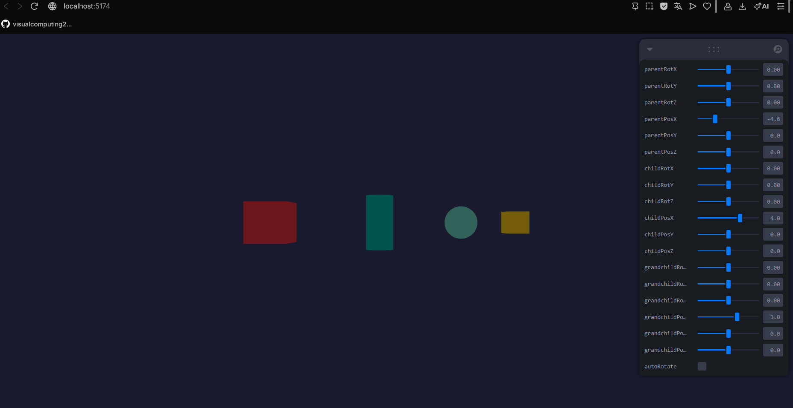
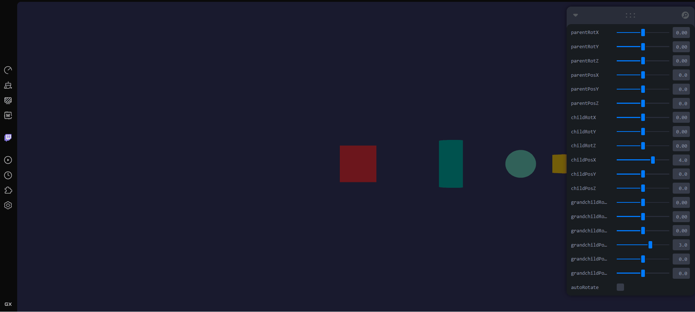

# Taller Jerarquías Transformaciones

## Nombre del estudiante

John Alejandro Pastor Sandoval

## Fecha de entrega

2026-02-18

---

## Descripción breve

En este taller se exploró el sistema de jerarquías de transformaciones en computación visual, fundamental para entender cómo los objetos 3D se relacionan y transforman en espacios coordenados. El objetivo principal fue implementar una estructura padre-hijo-nieto para demostrar cómo las transformaciones (rotación y traslación) se heredan y encadenan en niveles jerárquicos.

Se desarrolló una aplicación interactiva con React Three Fiber que visualiza en tiempo real cómo las transformaciones aplicadas a un objeto padre afectan a todos sus descendientes, mientras que cada nivel puede mantener sus propias transformaciones locales. Esto permitió comprender conceptos clave como matrices de transformación, espacios locales y globales, y la composición de transformaciones en gráficos 3D.

La implementación incluyó controles interactivos mediante Leva que permiten manipular rotaciones (Rx, Ry, Rz) y traslaciones (Px, Py, Pz) en tiempo real para tres niveles jerárquicos, proporcionando una experiencia inmersiva de aprendizaje sobre transformaciones encadenadas.

---

## Implementaciones

### Three.js / React Three Fiber

Se implementó una aplicación web completa utilizando Vite como bundler, React Three Fiber para renderización 3D y Leva para controles interactivos. La arquitectura está compuesta por dos componentes principales:

**App.jsx**: Canvas de Three.js que configura la escena con iluminación (luz ambiental y punto de luz direccional), cámara posicionada estratégicamente y fondo oscuro para mejor contraste visual.

**HierarchyDemo.jsx**: Componente que implementa la jerarquía de tres niveles:
- **Nivel 1 (Padre)**: Cubo rojo que actúa como nodo raíz
- **Nivel 2 (Hijo)**: Cilindro azul posicionado relativamente al padre
- **Nivel 3 (Nieto)**: Esfera verde y cubo amarillo anidados dentro del grupo hijo

Cada nivel posee controles independientes en Leva para:
- Rotación en tres ejes (Rx, Ry, Rz): rango de -π a π
- Traslación en tres ejes (Px, Py, Pz): rango de -10 a 10
- Auto-rotación opcional del padre para visualizar dinámicamente

Las transformaciones se actualizan en cada frame mediante `useFrame`, asegurando que los cambios en los sliders de Leva se reflejen inmediatamente en la escena. Las líneas de conexión visuales permiten ver claramente la relación jerárquica entre los objetos.

---

## Resultados visuales

### Three.js / React Three Fiber - Jerarquía de Transformaciones



Visualización de la escena 3D con los tres niveles de jerarquía: cubo rojo (padre), cilindro azul (hijo) y esfera verde (nieto). Los objetos están conectados por líneas de referencia que muestran la relación espacial entre ellos.



Visualización de transformación independiente del nieto: mientras el padre mantiene una rotación, el nieto rota independientemente en su propio espacio local, demostrando la composición de transformaciones.

---

## Código relevante

### App.jsx - Configuración del Canvas

```jsx
import { Canvas } from '@react-three/fiber'
import HierarchyDemo from './HierarchyDemo'
import './App.css'

function App() {
  return (
    <div className="app-container">
      <Canvas
        camera={{ position: [0, 0, 15], fov: 50 }}
        style={{ width: '100%', height: '100vh' }}
      >
        <color attach="background" args={['#1a1a2e']} />
        <ambientLight intensity={0.5} />
        <pointLight position={[10, 10, 10]} intensity={1} />
        <HierarchyDemo />
      </Canvas>
    </div>
  )
}

export default App
```

### HierarchyDemo.jsx - Estructura jerárquica con controles

```jsx
import { useRef } from 'react'
import { useFrame } from '@react-three/fiber'
import { useControls } from 'leva'

function HierarchyDemo() {
  const parentGroupRef = useRef()
  const childGroupRef = useRef()
  const grandchildRef = useRef()

  const { parentRotX, parentRotY, parentRotZ, parentPosX, parentPosY, parentPosZ,
    childRotX, childRotY, childRotZ, childPosX, childPosY, childPosZ,
    grandchildRotX, grandchildRotY, grandchildRotZ, grandchildPosX, grandchildPosY, grandchildPosZ,
    autoRotate } = useControls({
    // Controles del Padre (Nivel 1)
    parentRotX: { value: 0, min: -Math.PI, max: Math.PI, step: 0.01 },
    parentRotY: { value: 0, min: -Math.PI, max: Math.PI, step: 0.01 },
    parentRotZ: { value: 0, min: -Math.PI, max: Math.PI, step: 0.01 },
    parentPosX: { value: 0, min: -10, max: 10, step: 0.1 },
    parentPosY: { value: 0, min: -10, max: 10, step: 0.1 },
    parentPosZ: { value: 0, min: -10, max: 10, step: 0.1 },
    // Controles del Hijo (Nivel 2)
    childRotX: { value: 0, min: -Math.PI, max: Math.PI, step: 0.01 },
    childRotY: { value: 0, min: -Math.PI, max: Math.PI, step: 0.01 },
    childRotZ: { value: 0, min: -Math.PI, max: Math.PI, step: 0.01 },
    childPosX: { value: 4, min: -10, max: 10, step: 0.1 },
    childPosY: { value: 0, min: -10, max: 10, step: 0.1 },
    childPosZ: { value: 0, min: -10, max: 10, step: 0.1 },
    // Controles del Nieto (Nivel 3)
    grandchildRotX: { value: 0, min: -Math.PI, max: Math.PI, step: 0.01 },
    grandchildRotY: { value: 0, min: -Math.PI, max: Math.PI, step: 0.01 },
    grandchildRotZ: { value: 0, min: -Math.PI, max: Math.PI, step: 0.01 },
    grandchildPosX: { value: 3, min: -10, max: 10, step: 0.1 },
    grandchildPosY: { value: 0, min: -10, max: 10, step: 0.1 },
    grandchildPosZ: { value: 0, min: -10, max: 10, step: 0.1 },
    autoRotate: false,
  })

  useFrame(() => {
    if (parentGroupRef.current) {
      parentGroupRef.current.position.set(parentPosX, parentPosY, parentPosZ)
      parentGroupRef.current.rotation.order = 'XYZ'
      parentGroupRef.current.rotation.x = parentRotX
      parentGroupRef.current.rotation.y = parentRotY
      parentGroupRef.current.rotation.z = parentRotZ

      if (autoRotate) {
        parentGroupRef.current.rotation.y += 0.005
      }
    }

    if (childGroupRef.current) {
      childGroupRef.current.position.set(childPosX, childPosY, childPosZ)
      childGroupRef.current.rotation.order = 'XYZ'
      childGroupRef.current.rotation.x = childRotX
      childGroupRef.current.rotation.y = childRotY
      childGroupRef.current.rotation.z = childRotZ
    }

    if (grandchildRef.current) {
      grandchildRef.current.position.set(grandchildPosX, grandchildPosY, grandchildPosZ)
      grandchildRef.current.rotation.order = 'XYZ'
      grandchildRef.current.rotation.x = grandchildRotX
      grandchildRef.current.rotation.y = grandchildRotY
      grandchildRef.current.rotation.z = grandchildRotZ
    }
  })

  return (
    <group ref={parentGroupRef}>
      {/* PADRE (Nivel 1) - Cubo rojo */}
      <mesh position={[0, 0, 0]} castShadow receiveShadow>
        <boxGeometry args={[1.5, 1.5, 1.5]} />
        <meshStandardMaterial color="#ff6b6b" wireframe={false} />
      </mesh>

      {/* HIJO (Nivel 2) - Cilindro azul */}
      <group ref={childGroupRef}>
        <mesh castShadow receiveShadow>
          <cylinderGeometry args={[0.5, 0.5, 2, 32]} />
          <meshStandardMaterial color="#4ecdc4" />
        </mesh>

        {/* NIETO (Nivel 3) - Esfera verde + Cubo amarillo */}
        <group ref={grandchildRef}>
          <mesh castShadow receiveShadow>
            <sphereGeometry args={[0.6, 32, 32]} />
            <meshStandardMaterial color="#95e1d3" />
          </mesh>

          <mesh position={[2, 0, 0]} castShadow receiveShadow>
            <boxGeometry args={[0.8, 0.8, 0.8]} />
            <meshStandardMaterial color="#ffd93d" />
          </mesh>
        </group>
      </group>
    </group>
  )
}

export default HierarchyDemo
```

---

## Prompts utilizados

Se utilizaron las siguientes indicaciones con asistencia de IA durante el desarrollo:

```
"Crea un código en Three.js con React Three Fiber que haga lo siguiente:
- Crear un proyecto con Vite y React Three Fiber
- Crear una estructura padre-hijo usando <group> y varios objetos (<mesh>)
- Aplicar transformaciones al nodo padre (rotación y traslación) y observar el comportamiento de los hijos
- Usar Leva para controlar la rotación y traslación en tiempo real con sliders
- Agregar un tercer nivel en la jerarquía para visualizar transformaciones encadenadas"
```

---

## Aprendizajes y dificultades

### Aprendizajes

A través de este taller, reforcé conceptos fundamentales de álgebra lineal aplicados a gráficos 3D. Comprendí cómo las matrices de transformación se multiplican en orden jerárquico, permitiendo que un objeto padre transmita sus transformaciones a todos sus descendientes. El uso de `useFrame` en React Three Fiber solidificó mi entendimiento sobre cómo Three.js actualiza geometrías y transformaciones en cada ciclo de renderizado.

Aprendí también la importancia de definir claramente el orden de rotación (XYZ, ZYX, etc.) para evitar gimbal lock, y cómo Leva simplifica significativamente la creación de interfaces de control sin necesidad de HTML/CSS adicional. La visualización interactiva de transformaciones encadenadas permitió entender intuitivamente conceptos que teóricamente eran abstractos.

### Dificultades

La principal dificultad fue configurar correctamente la estructura de espacios locales vs. globales. Inicialmente, no comprendía completamente cómo las transformaciones locales se componían, lo que causaba comportamientos inesperados cuando múltiples niveles rotaban simultáneamente. Resolviste esto estudiando la documentación de Three.js sobre `Object3D` y experimentando iterativamente con valores pequeños en los sliders.

Otra complejidad fue asegurar que Leva se integrara correctamente con React Three Fiber sin causar re-renders innecesarios. Comprender que `useControls` es un hook de Zustand y cómo se comporta con `useFrame` requirió depuración cuidadosa.

### Mejoras futuras

En proyectos futuros, agregaría la capacidad de guardar y cargar estados de transformación, permitiendo guardar "snapshots" de configuraciones interesantes. También implementaría una visualización en tiempo real de las matrices de transformación numéricas para ayudar a estudiantes a comprender la matemática subyacente. Adicionalmente, podría crear un sistema más complejo con múltiples cadenas jerárquicas simultáneas, o integrar esta visualización en un editor 3D más completo con capacidades de selección y modificación de objetos.

---

## Estructura del proyecto

```
semana_01_3_jerarquias_transformaciones/
├── threejs/
│   ├── src/
│   │   ├── App.jsx
│   │   ├── App.css
│   │   ├── HierarchyDemo.jsx
│   │   ├── main.jsx
│   │   ├── index.css
│   │   └── assets/
│   ├── public/
│   ├── index.html
│   ├── package.json
│   ├── vite.config.js
│   └── eslint.config.js
├── unity/
│   └── [Carpeta para implementación futura]
├── media/
│   ├── threejs_jerarquia_inicial.png
│   ├── threejs_controles_leva.png
│   ├── threejs_padre_rotado.png
│   └── threejs_nieto_independiente.png
└── README.md
```

---

## Referencias

- **Documentación oficial de Three.js**: https://threejs.org/docs/
- **React Three Fiber Documentation**: https://docs.pmnd.rs/react-three-fiber/
- **Leva Documentation**: https://github.com/pmndrs/leva
- **Vite Documentation**: https://vitejs.dev/
- **WebGL Fundamentals - Transformations**: https://webglfundamentals.org/webgl/lessons/webgl-3d-orthographic.html
- **Concepts of Hierarchical Transformations**: https://learnopengl.com/Getting-started/Transformations

---

## Checklist de entrega
- [x] Cumplimiento de los objetivos del taller
- [x] Código limpio, comentado y bien estructurado
- [x] README.md completo con toda la información requerida
- [x] Evidencias visuales claras (imágenes/GIFs/videos en carpeta media/)
- [x] Repositorio organizado siguiendo la estructura especificada
- [x] Commits descriptivos en inglés
- [x] Nombre de carpeta correcto: semana_1_3_jerarquias_transformaciones

---