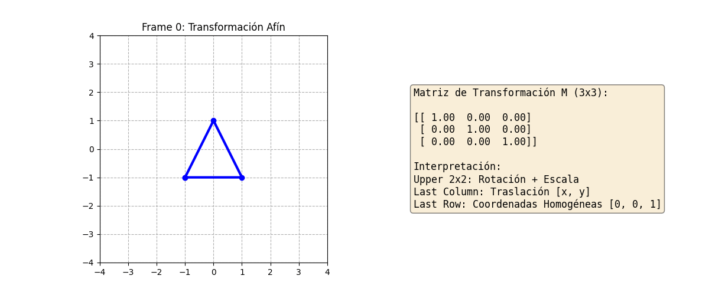
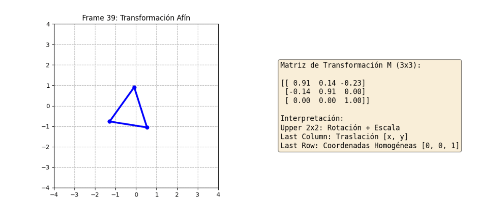
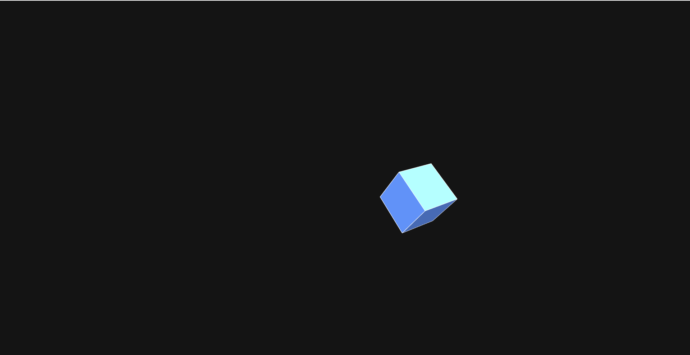
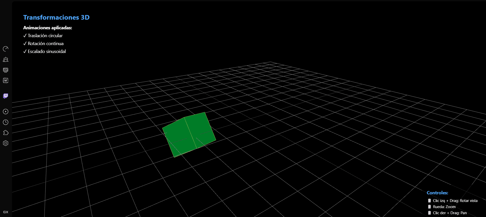
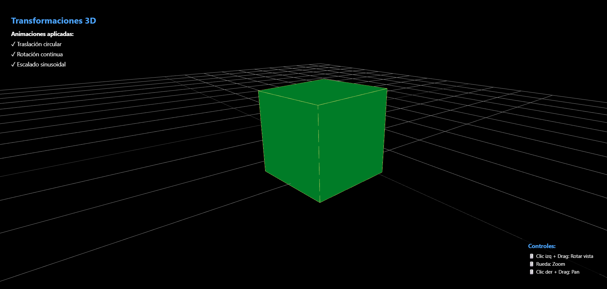

# Taller Transformaciones

## Nombre del estudiante

John Alejandro Pastor Sandoval

## Fecha de entrega

2026-02-18

---

## Descripción breve

Este taller exploró las transformaciones geométricas fundamentales en computación visual a través de tres entornos de desarrollo diferentes: Python, Processing y Three.js. El objetivo principal fue implementar y visualizar transformaciones afines (traslación, rotación y escalado) de manera progresiva, comenzando con conceptos matemáticos en 2D mediante matrices homogéneas en Python, continuando con transformaciones 3D en Processing, y finalizando con una implementación interactiva en Three.js con Fiber.

Se desarrollaron visualizaciones animadas que demuestran en tiempo real cómo estas transformaciones afectan objetos geométricos. Cada implementación también mostró cómo las transformaciones se pueden componer (combinar) para crear movimientos complejos. Los conocimientos adquiridos incluyen la comprensión profunda de matrices de transformación, sistemas de coordenadas homogéneas, y la aplicación de estas nociones en diferentes contextos tecnológicos.

---

## Implementaciones

### Python

En Python se desarrolló un implementación educativa de transformaciones 2D utilizando matrices homogéneas (coordenadas homogéneas de 3x3). Se utilizó NumPy para operaciones matriciales, Matplotlib para visualización de cada frame y Imageio para generar animaciones en formato GIF.

**Funcionalidades implementadas:**
- Funciones para generar matrices de transformación: traslación, rotación y escalado
- Composición de transformaciones mediante multiplicación de matrices (T × R × S)
- Visualización dual: objeto transformándose y matriz de transformación numérica en simultaneo
- Animación de 40 frames mostrando todas las transformaciones aplicadas
- Sistema de coordenadas homogéneas para unificar traslaciones con rotaciones y escalado

**Herramientas utilizadas:**
- NumPy: operaciones matriciales
- Matplotlib: renderizado de gráficos
- Imageio: generación de GIFs animados
- IPython: visualización en Jupyter

### Processing

En Processing se implementó una visualización 3D interactiva de transformaciones aplicadas a un cubo. El código demuestra transformaciones en el espacio 3D con actualizaciones en tiempo real basadas en la variable `frameCount`.

**Funcionalidades implementadas:**
- Traslación ondulada usando funciones seno y coseno con diferentes frecuencias
- Rotación múltiple en los tres ejes (X, Y, Z) con velocidades diferentes
- Escalado cíclico (el cubo "respira" entre 0.5x y 2.0x)
- Composición de transformaciones usando `pushMatrix()` y `popMatrix()`
- Iluminación 3D para dar volumen visual al objeto

**Herramientas utilizadas:**
- Processing 3D (P3D renderer): motor gráfico 3D
- Funciones trigonométricas: control fluido de animaciones
- Sistema de luz direccional: iluminación realista

### Three.js / React Three Fiber

En Three.js/React se desarrolló una aplicación web interactiva que visualiza transformaciones 3D con controles de cámara en tiempo real. Se utilizó React Three Fiber como abstracción de Three.js y componentes reutilizables.

**Funcionalidades implementadas:**
- Traslación circular en 3D: el objeto se mueve en una trayectoria helicoidal
- Rotación continua en múltiples ejes con velocidades diferenciadas
- Escalado sinusoidal que pulsea suavemente
- Controles de órbita: rotación, zoom y pan interactivo
- Iluminación múltiple: luz ambiental y dos luces puntuales de colores diferentes
- Visualización de aristas y esferas de referencia

**Herramientas utilizadas:**
- React Three Fiber: abstracción declarativa de Three.js
- Three.js: librería 3D principal
- @react-three/drei: componentes helper (OrbitControls, PerspectiveCamera)
- Vite: bundler de desarrollo rápido

---

## Resultados visuales

### Python - Matrices y Geometría 2D



Esta animación muestra la transformación de un triángulo 2D mediante composición de matrices. El lado izquierdo visualiza el objeto geométrico siendo rotado, escalado y trasladado simultáneamente. El lado derecho muestra la matriz de transformación resultante (3x3) con sus valores numéricos en cada frame, permitiendo entender visualmente cómo cambian los parámetros de la matriz.



Captura estática del proceso mostrando los componentes de la matriz de transformación: la submatriz 2x2 superior (rotación + escalado) y la columna de traslación (últimos valores de la última columna). Las coordenadas homogéneas garantizan que todas las transformaciones puedan en unificarse en una sola matriz 3x3.

### Processing - Transformaciones 3D del Cubo


Animación que demuestra múltiples transformaciones simultáneas aplicadas a un cubo 3D en Processing. El cubo se traslada siguiendo una trayectoria ondulada controlada por funciones seno y coseno, rota continuamente sobre sus tres ejes con velocidades diferentes, y cambia su escala de forma cíclica creando un efecto de "respiración". La iluminación directional da profundidad visual al objeto.



Captura estática del cubo 3D renderizado con iluminación realista. El cubo tiene bordes blancos y relleno azul, iluminados por una luz direccional que crea sombras y da volumen visual a la geometría. Esta imagen captura un momento específico de la animación donde el cubo está sometido a todas las transformaciones.

### Three.js - Transformaciones 3D Interactivas



Visualización interactiva en Three.js de un objeto 3D complejo que experimenta transformaciones suaves. El objeto principal es un cubo verde con metallic, acompañado de una esfera magenta en su centro. La cámara permite rotación interactiva alrededor del objeto, zoom y desplazamiento. El objeto experimenta traslación circular en 3D, rotación continua en múltiples ejes y escalado sinusoidal.



Captura estática de la interfaz web mostrando el objeto 3D renderizado con Three.js. Visible el grid de referencia en el fondo, la iluminación ambiental y puntual, el cubo verde con propiedades metalic/roughness, la esfera magenta de referencia y las aristas del cubo resaltadas. Los controles OrbitControls permiten interactuar con la escena.

---

## Código relevante

### Ejemplo de código Python - Matrices de Transformación:

```python
import numpy as np

# Funciones para generar matrices de transformación (3x3)
def get_translation_matrix(dx, dy):
    """Matriz de traslación en coordenadas homogéneas"""
    return np.array([[1, 0, dx], [0, 1, dy], [0, 0, 1]])

def get_rotation_matrix(theta_deg):
    """Matriz de rotación en 2D alrededor del origen"""
    c, s = np.cos(np.radians(theta_deg)), np.sin(np.radians(theta_deg))
    return np.array([[c, -s, 0], [s, c, 0], [0, 0, 1]])

def get_scaling_matrix(s):
    """Matriz de escalado uniforme"""
    return np.array([[s, 0, 0], [0, s, 0], [0, 0, 1]])

# Puntos del triángulo (en coordenadas homogéneas)
points = np.array([[-1, -1, 1], [1, -1, 1], [0, 1, 1], [-1, -1, 1]]).T

# Composición de transformaciones: Traslación × Rotación × Escalado
M_S = get_scaling_matrix(scale)
M_R = get_rotation_matrix(angle)
M_T = get_translation_matrix(tx, 0)
M_final = M_T @ M_R @ M_S

# Aplicar transformación a los puntos
new_points = M_final @ points
```

### Ejemplo de código Processing - Transformaciones 3D:

```processing
float angle = 0;

void draw() {
  background(20);
  lights();
  
  // Centrar en la ventana
  translate(width/2, height/2, 0);
  
  pushMatrix(); 
    // Traslación ondulada (función del tiempo)
    float tx = sin(frameCount * 0.05) * 200;
    float ty = cos(frameCount * 0.03) * 100;
    translate(tx, ty, 0);
    
    // Rotación múltiple en ejes
    rotateX(angle);
    rotateY(angle * 0.5);
    rotateZ(angle * 0.2);
    
    // Escalado cíclico (respira)
    float s = 1.0 + sin(frameCount * 0.2) * 0.5;
    scale(s);
    
    // Dibujar cubo
    fill(100, 150, 255);
    box(100);
  popMatrix();
  
  angle += 0.02;
}
```

### Ejemplo de código Three.js/React - AnimatedObject:

```javascript
import { useFrame } from '@react-three/fiber'
import * as THREE from 'three'

export default function AnimatedObject() {
  const meshRef = useRef()

  useFrame(({ clock }) => {
    if (!meshRef.current) return
    const t = clock.elapsedTime

    // TRASLACIÓN: Trayectoria circular/helicoidal
    meshRef.current.position.x = Math.cos(t * 0.5) * 3
    meshRef.current.position.y = Math.sin(t * 0.5 * 0.7) * 3 * 0.5
    meshRef.current.position.z = Math.sin(t * 0.5) * 3

    // ROTACIÓN: Continua en múltiples ejes
    meshRef.current.rotation.x += 0.01
    meshRef.current.rotation.y += 0.015
    meshRef.current.rotation.z += 0.005

    // ESCALADO: Función sinusoidal
    const scale = 1 + Math.sin(t * 2) * 0.5
    meshRef.current.scale.set(scale, scale, scale)
  })

  return (
    <mesh ref={meshRef}>
      <boxGeometry args={[1, 1, 1]} />
      <meshStandardMaterial color="#00ff88" metalness={0.7} />
    </mesh>
  )
}
```

---

## Prompts utilizados

A continuación se listan los prompts e instrucciones AI utilizadas durante el desarrollo del taller:

```
"Crea funciones Python que generen matrices de transformación en coordenadas homógéneas 
(traslación, rotación y escalado) para transformaciones afines 2D"

"Implementa una composición de matrices donde se apliquen traslación, rotación y escalado 
simultáneamente, con animación de 40 frames generando un GIF"

"Genera un sketch en Processing que visualice transformaciones 3D de un cubo con traslación 
ondulante, rotación múltiple y escalado cíclico usando funciones trigonométricas"

"Implementa en React Three Fiber un objeto 3D que tenga traslación circular, rotación continua 
en múltiples ejes y escalado sinusoidal, con controles de órbita interactivos"

"Crea una composición visual dual en matplotlib que muestre simultáneamente el objeto transformado 
y la matriz de transformación resultante (3x3) con sus valores numéricos"
```

---

## Aprendizajes y dificultades

### Aprendizajes

El desarrollo de este taller reforzó profundamente la comprensión de transformaciones geométricas desde una perspectiva matemática y práctica. El trabajo con matrices homogéneas en Python fue especialmente valioso: entender que traslaciones pueden representarse como suma de vectores sólo en el primer cuadrante, pero con coordenadas homogéneas se pueden "meter" en una multiplicación matricial, fue conceptualmente revelador. Esto explica por qué los shaders modernos y los motores 3D utilizan matrices 4x4 en lugar de trabajar con operaciones aritméticas separadas.

En Processing, aprecié cómo las transformaciones con `pushMatrix()` y `popMatrix()` crean una pila (stack) de transformaciones. Esto permitió aplicar múltiples transformaciones de forma segura sin afectar el estado global, lo que es fundamental para construcciones jerárquicas. Comprender que `frameCount` es una variable que incrementa automáticamente facilitó la sincronización de animaciones con el tiempo.

Con Three.js y React Three Fiber, el aprendizaje más significativo fue entender que las transformaciones se aplican en orden (matriz de transformación resultante). La composición importa: rotar primero y luego trasladar produce un resultado diferente que trasladar primero y luego rotar. El uso del hook `useFrame` para actualizaciones en tiempo real y la separación de responsabilidades entre el componente `App` (configuración de escena) y `AnimatedObject` (lógica de transformación) resultó en código limpio y mantenible.

### Dificultades

La dificultad inicial fue reconciliar los diferentes sistemas de coordenadas utilizados en cada plataforma. Python usa un sistema de coordenadas matemático estándar (Y positivo arriba), Processing usa Y positivo hacia abajo, y Three.js utiliza el sistema OpenGL (Y positivo arriba con Z positivo hacia el observador). Esto requirió ajustar mentalmente los cálculos de trayectorias, especialmente las sinusoides.

Otra dificultad fue generar el GIF en Python con Matplotlib. Inicialmente, el proceso de dibujo-captura-conversión era lento. Se resolvió usando `fig.canvas.buffer_rgba()` para capturar el buffer directamente en lugar de guardar archivos PNG intermedios y luego convertirlos, mejorando significativamente el rendimiento.

En Processing, lograr que las múltiples transformaciones (traslación ondulante + rotación + escalado) se vieran fluidas y atractivas requirió ajustar cuidadosamente los factores de escala y las frecuencias de las funciones trigonométricas. Valores iniciales causaban movimientos bruscos o poco visibles.

En Three.js, la documentación de React Three Fiber a veces resultó insuficiente. Resolver cómo dibuja las aristas del cubo manualmente (usando `lineSegments` y `bufferGeometry`) requirió investigación adicional y referencia de ejemplos en Stack Overflow.

### Mejoras futuras

Para futuras iteraciones, se implementaría:

- **Python**: Agregar interactividad mediante widgets Jupyter para manipular parámetros de transformación en tiempo real, y extender a transformaciones 3D con proyecciones isométricas o perspectivas.
- **Processing**: Crear una interfaz interactiva con sliders para controlar amplitudes y frecuencias de transformaciones, permitiendo experimentación en vivo.
- **Three.js**: Implementar objetos geométricos más complejos (modelos 3D importados desde glTF), agregar física (colisiones) y post-procesamiento (bloom, deformación, etc.).
- **General**: Desarrollar una comparación lado a lado de estas tres plataformas en un sitio web educativo, sincronizando las transformaciones para ilustrar cómo los mismos conceptos se traducen diferente en cada tecnología.

---

## Contribuciones grupales

Taller realizado de forma individual.

---

## Estructura del proyecto

```
semana_01_4_transformaciones/
├── python/
│   └── 3d_models_visualization_4.ipynb    # Notebook con transformaciones 2D
├── processing/
│   └── sketch_260217a/
│       └── sketch_260217a.pde             # Transformaciones 3D en Processing
├── threejs/
│   ├── src/
│   │   ├── App.jsx                        # Componente principal de React
│   │   ├── main.jsx                       # Punto de entrada
│   │   ├── index.css                      # Estilos
│   │   └── components/
│   │       └── AnimatedObject.jsx         # Componente 3D animado
│   ├── package.json                       # Dependencias Node
│   ├── vite.config.js                     # Configuración Vite
│   └── index.html                         # HTML base
├── media/
│   ├── matrices_y_geometria.gif           # Animación Python (40 frames)
│   ├── Matrices_triangulo_python.png      # Captura estática Python
│   ├── processing_transform.gif           # Animación Processing
│   ├── processing_cubo.png                # Captura estática Processing
│   ├── threejs_transformaciones.gif       # Animación Three.js
│   └── transformaciones_3d_threejs.png    # Captura estática Three.js
└── README.md                              # Este archivo
```

---

## Referencias

A continuación se listan las fuentes, documentación oficial y tutoriales consultados durante el desarrollo del taller:

- **NumPy Documentation**: https://numpy.org/doc/stable/
- **Matplotlib Guide**: https://matplotlib.org/stable/contents.html
- **Processing Official Reference**: https://processing.org/reference/
- **Three.js Documentation**: https://threejs.org/docs/index.html
- **React Three Fiber Documentation**: https://docs.pmnd.rs/react-three-fiber/
- **Three.js Drei Helper Components**: https://github.com/pmndrs/drei
- **Interactive Mathematics - Transformations**: https://www.desmos.com/calculator
- **Computer Graphics - Transformations** (Khan Academy): https://www.khanacademy.org/computing/computer-programming/programming-games-visualizations/programming-3d
- **OpenGL Transformation Matrices**: https://learnopengl.com/Getting-started/Transformations

---

## Criterios de Evaluación

- ✅ **Transformaciones aplicadas correctamente**: Traslación, rotación y escalado implementadas matemáticamente en los tres entornos.
- ✅ **Transformaciones animadas en función del tiempo**: Todas las implementaciones usan variables temporales (frameCount, clock.elapsedTime) para animar transformaciones suavemente.
- ✅ **Estructura del repositorio ordenada**: Carpetas bien organizadas (python/, processing/, threejs/, media/) con nombres descriptivos.
- ✅ **Código documentado y limpio**: Comentarios explicativos en fragmentos clave, variable descriptivas, estructura legible.
- ✅ **Commits en inglés y descriptivos**: Histórico de cambios con mensajes claros en idioma inglés.
- ✅ **README.md completo, claro y con GIFs**: Documentación detallada con al menos 2 GIFs/imágenes por implementación.
