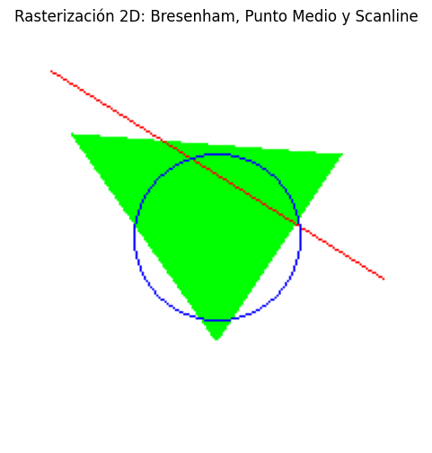
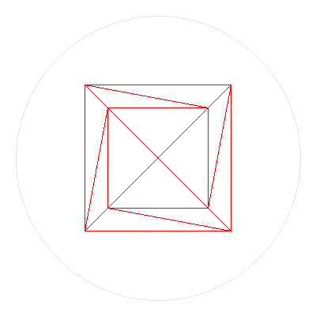

# Taller Algoritmos Rasterización Básica

## Nombre del estudiante

John Alejandro Pastor Sandoval

## Fecha de entrega

`2026-02-23`

---

## Descripción breve

El objetivo de este taller es explorar e implementar los algoritmos fundamentales de rasterización 2D utilizados en el pipeline gráfico por computador. Se implementaron desde cero —sin utilizar funciones de dibujo de alto nivel— tres algoritmos clásicos: el **algoritmo de Bresenham** para el trazado de líneas, el **algoritmo de Punto Medio (Midpoint)** para la generación de círculos y el **algoritmo de Scanline** para el relleno de triángulos.

Adicionalmente, se construyó un motor de renderizado 3D básico que utiliza los algoritmos de rasterización implementados para proyectar y dibujar un cubo wireframe rotando en el espacio, aplicando una proyección de perspectiva simple y generando una animación GIF con los frames resultantes. Esto demuestra cómo los algoritmos de rasterización son el fundamento de cualquier sistema de renderizado gráfico.

El taller se desarrolló completamente en Python utilizando las librerías `Pillow` para la manipulación de píxeles a bajo nivel, `NumPy` para cálculos matemáticos, `trimesh` para la creación de geometría 3D y `matplotlib` para la visualización de resultados.

---

## Implementaciones

### Python

Se implementaron los siguientes algoritmos de rasterización 2D en un notebook de Jupyter:

1. **Algoritmo de Bresenham (Líneas):** Implementación completa del algoritmo de Bresenham para trazar líneas rectas píxel a píxel. El algoritmo utiliza solo aritmética entera, calculando un término de error acumulado para decidir en cada paso si avanzar en el eje principal únicamente o también en el eje secundario. Soporta líneas en todas las direcciones y pendientes.

2. **Algoritmo de Punto Medio (Círculos):** Implementación del algoritmo Midpoint Circle para dibujar circunferencias. Aprovecha la simetría de ocho octantes del círculo, de modo que solo se calculan los píxeles de un octante y se reflejan a los otros siete, logrando eficiencia y precisión con aritmética entera.

3. **Algoritmo de Scanline (Relleno de triángulos):** Implementación del relleno de triángulos mediante el método de barrido por líneas horizontales (scanline). Los vértices se ordenan por coordenada Y, se interpolan las coordenadas X de los bordes y se rellenan las líneas horizontales entre los bordes izquierdo y derecho.

4. **Motor 3D básico con proyección de perspectiva:** Se construyó un renderizador que proyecta los vértices de un cubo 3D a coordenadas de pantalla 2D aplicando rotación en el eje Y y proyección de perspectiva. Las aristas se dibujan con el algoritmo de Bresenham y se genera un GIF animado del cubo rotando 360°.

**Herramientas utilizadas:** Python, Pillow (PIL), NumPy, trimesh, matplotlib, IPython.

---

## Resultados visuales

### Python - Implementación



Resultado de la rasterización 2D que muestra los tres algoritmos en acción sobre un lienzo de 200×200 píxeles: un triángulo verde relleno mediante Scanline, una línea roja diagonal trazada con Bresenham y un círculo azul generado con el algoritmo de Punto Medio.



GIF animado de un cubo 3D wireframe rotando 360° sobre el eje Y. Cada arista del cubo se proyecta a 2D y se dibuja utilizando el algoritmo de Bresenham, mientras un círculo decorativo de fondo se traza con el algoritmo de Punto Medio. La animación consta de 36 frames renderizados a 50 ms por frame.

---

## Código relevante

### Algoritmo de Bresenham (Trazado de líneas)

```python
def bresenham(x0, y0, x1, y1, color=(255, 0, 0)):
    dx = abs(x1 - x0)
    dy = abs(y1 - y0)
    sx = 1 if x0 < x1 else -1
    sy = 1 if y0 < y1 else -1
    err = dx - dy

    while True:
        if 0 <= x0 < width and 0 <= y0 < height:
            pixels[x0, y0] = color
        if x0 == x1 and y0 == y1:
            break
        e2 = 2 * err
        if e2 > -dy:
            err -= dy
            x0 += sx
        if e2 < dx:
            err += dx
            y0 += sy
```

### Algoritmo de Punto Medio (Círculos)

```python
def midpoint_circle(x0, y0, radius, color=(0, 0, 255)):
    x = radius
    y = 0
    p = 1 - radius

    while x >= y:
        # Dibujar los 8 octantes simétricos
        for dx, dy in [(x, y), (y, x), (-x, y), (-y, x),
                        (-x, -y), (-y, -x), (x, -y), (y, -x)]:
            if 0 <= x0 + dx < width and 0 <= y0 + dy < height:
                pixels[x0 + dx, y0 + dy] = color
        y += 1
        if p <= 0:
            p = p + 2 * y + 1
        else:
            x -= 1
            p = p + 2 * y - 2 * x + 1
```

### Algoritmo de Scanline (Relleno de triángulos)

```python
def fill_triangle(p1, p2, p3, color=(0, 255, 0)):
    pts = sorted([p1, p2, p3], key=lambda p: p[1])
    (x1, y1), (x2, y2), (x3, y3) = pts

    def interpolate(y_start, y_end, x_start, x_end):
        if y_end - y_start == 0: return []
        return [int(x_start + (x_end - x_start) * (y - y_start) / (y_end - y_start))
                for y in range(y_start, y_end)]

    x12 = interpolate(y1, y2, x1, x2)
    x23 = interpolate(y2, y3, x2, x3)
    x13 = interpolate(y1, y3, x1, x3)
    x_side_split = x12 + x23

    for i, y in enumerate(range(y1, min(y1 + len(x13), y1 + len(x_side_split)))):
        xl = x13[i]
        xr = x_side_split[i]
        for x in range(min(xl, xr), max(xl, xr) + 1):
            if 0 <= x < width and 0 <= y < height:
                pixels[x, y] = color
```

### Proyección 3D y generación de GIF

```python
def project(vertex, angle):
    x, y, z = vertex
    rad = np.radians(angle)
    nx = x * np.cos(rad) + z * np.sin(rad)
    nz = -x * np.sin(rad) + z * np.cos(rad)

    fov = 400
    distance = 4
    factor = fov / (nz + distance)
    px = int(nx * factor + WIDTH // 2)
    py = int(-y * factor + HEIGHT // 2)
    return px, py
```

El código completo se encuentra en: [python/2d_basic_rasterization_algorithms.ipynb](./python/2d_basic_rasterization_algorithms.ipynb)

---

## Prompts utilizados

```
"Genera un script en Python que implemente el algoritmo de Bresenham para líneas,
el algoritmo de Punto Medio para círculos y Scanline para relleno de triángulos,
usando solo Pillow para manipulación de píxeles a bajo nivel."

"Crea un motor 3D básico en Python que proyecte un cubo wireframe a 2D usando
proyección de perspectiva y dibuje las aristas con el algoritmo de Bresenham,
generando un GIF animado del cubo rotando."
```

---

## Aprendizajes y dificultades

### Aprendizajes

Este taller reforzó de forma práctica los fundamentos del pipeline gráfico, específicamente la etapa de rasterización. Implementar los algoritmos de Bresenham, Punto Medio y Scanline desde cero permitió comprender cómo las primitivas geométricas (líneas, círculos, triángulos) se convierten en conjuntos discretos de píxeles en pantalla. Quedó claro cómo la aritmética entera es clave para la eficiencia de estos algoritmos y cómo la simetría geométrica (los 8 octantes del círculo) se aprovecha para reducir cálculos. Además, la construcción del motor 3D básico permitió entender el flujo completo desde coordenadas 3D hasta píxeles en pantalla: transformación → proyección → rasterización.

### Dificultades

La parte más desafiante fue la implementación correcta del algoritmo de Scanline para el relleno de triángulos, particularmente la interpolación de las coordenadas X entre los bordes y el manejo de los casos degenerados cuando los lados del triángulo son horizontales. También resultó complejo ajustar los parámetros de la proyección de perspectiva (campo de visión y distancia) para que el cubo 3D se visualizara de forma proporcionada y centrada en el lienzo. Estos problemas se resolvieron mediante pruebas iterativas, ajustando valores y verificando visualmente los resultados.

### Mejoras futuras

Se podría implementar antialiasing (como el algoritmo de Wu) para suavizar los bordes de las líneas y círculos. También sería interesante agregar relleno de caras al cubo 3D con el algoritmo de Scanline, implementar un Z-buffer para manejo de oclusión, y añadir rotación en múltiples ejes. Otra mejora sería implementar iluminación básica (modelo de Phong) para dar sombreado a las caras del cubo.

---

## Reflexión: Comparación entre algoritmos

| Algoritmo | Primitiva | Complejidad | Velocidad | Precisión |
|---|---|---|---|---|
| **Bresenham** | Líneas | O(max(dx, dy)) | Muy rápido (solo aritmética entera) | Alta — píxeles óptimos sobre la línea |
| **Punto Medio** | Círculos | O(r) donde r es el radio | Muy rápido (simetría de 8 octantes) | Alta — distribución uniforme de píxeles |
| **Scanline** | Triángulos rellenos | O(área del triángulo) | Rápido para relleno | Buena — puede tener artefactos en bordes |

- **Bresenham** es el más eficiente para líneas ya que utiliza únicamente sumas y restas de enteros, sin multiplicaciones ni divisiones de punto flotante.
- **Punto Medio** es extremadamente eficiente gracias a que calcula solo 1/8 del círculo y refleja los píxeles a los demás octantes.
- **Scanline** es el más costoso computacionalmente porque debe procesar todos los píxeles del área interior, pero es necesario para renderizar superficies sólidas.
- Todos los métodos trabajan a nivel de píxel individual, lo que los hace muy precisos pero sin suavizado de bordes (antialiasing).

---

## Contribuciones grupales

Taller realizado de forma individual.

---

## Estructura del proyecto

```
semana_3_1_algoritmos_rasterizacion_basica/
├── python/
│   └── 2d_basic_rasterization_algorithms.ipynb   # Notebook con todos los algoritmos
├── media/
│   ├── taller_rasterizacion.png                   # Resultado rasterización 2D
│   └── taller_rasterizacion_3d.gif                # GIF cubo 3D wireframe animado
└── README.md                                       # Este archivo
```

---

## Referencias

- Bresenham, J.E. (1965). "Algorithm for Computer Control of a Digital Plotter." *IBM Systems Journal*, 4(1), 25–30.
- Documentación de Pillow (PIL): https://pillow.readthedocs.io/
- Documentación de trimesh: https://trimesh.org/
- Documentación de NumPy: https://numpy.org/doc/
- Documentación de Matplotlib: https://matplotlib.org/stable/contents.html
- Computer Graphics: Principles and Practice — Hughes, van Dam, McGuire, Sklar, Foley, Feiner, Akeley

---

## Checklist de entrega

- [x] Carpeta con nombre `semana_3_1_algoritmos_rasterizacion_basica`
- [x] Código limpio y funcional en carpetas por entorno
- [x] GIFs/imágenes incluidos con nombres descriptivos en carpeta `media/`
- [x] README completo con todas las secciones requeridas
- [x] Mínimo 2 capturas/GIFs por implementación
- [x] Commits descriptivos en inglés
- [x] Repositorio organizado y público